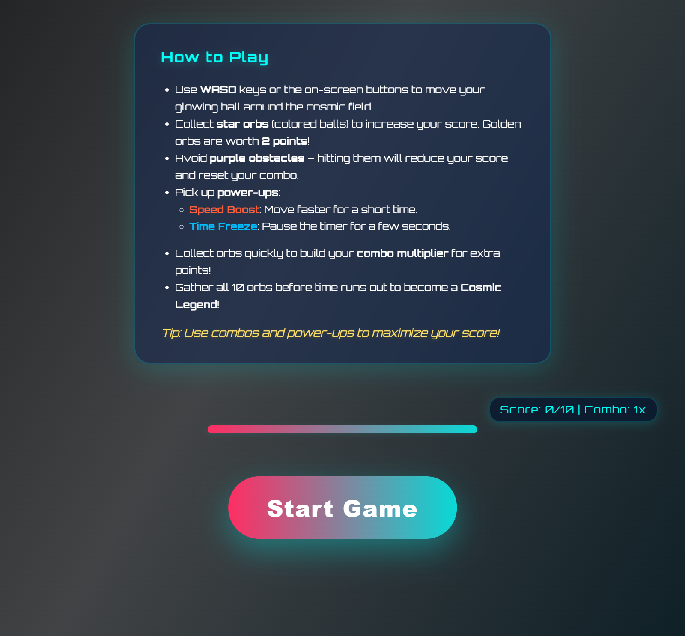

# 🎮 Ball Collect Game

**Ball Collect Game** is a fun and simple web-based game created using **HTML**, **CSS**, and **JavaScript**. This game is perfect for beginners to understand how web technologies can be used to make interactive and dynamic applications like games.

---

## 🧒 What is the Game About?

In this game, the player controls a character (or object) on the screen and tries to **collect balls** that appear randomly. Every time the player collects a ball, the score increases.

---

## 🛠️ Tools and Technologies Used

- **HTML** – to build the structure of the game
- **CSS** – to design how the game looks
- **JavaScript** – to add logic, control the game, and make it interactive

---

## 🌟 Features

- **🎯 Responsive Design** – Playable on both desktop and mobile screens
- **⚡ Dynamic Gameplay** – Balls appear in different positions with real-time player movement
- **🎮 Interactive Controls** – Move the player using keyboard keys
- **📈 Score Tracking** – Your score increases with every collected ball

---

## 🕹️ How to Play

1. **Open the Game**  
   - Download or clone the project.
   - Open the file named `index.html` in any browser (like Chrome or Firefox).

2. **Controls**  
   - Use **Arrow keys** (⬆️⬇️⬅️➡️) or **WASD** keys to move your player.
   - Move towards the balls to collect them and increase your score.

3. **Goal**  
   - Collect as many balls as possible without missing them!

---


## 📷 Screenshots



---

## 📦 How to Run the Game

### Option 1: Run Locally
1. Download or clone the project:
   ```
   git clone https://github.com/Madhuri-0607/Ball-collect-game.git
   ```
2. Open the project folder.
3. Double-click on `index.html` to open the game in your browser.

### Option 2: Use Live Server (VS Code)
1. Install the **Live Server** extension in VS Code.
2. Right-click on `index.html` and choose **"Open with Live Server"**.

---

## 🙋‍♀️ About Me

Hi! I'm **Madhuri**, a frontend web developer passionate about building interactive, dynamic, and responsive web applications using HTML, CSS, and JavaScript.

---

## 🔗 Useful Links

- **GitHub Project:** [Ball Collect Game](https://github.com/Madhuri-0607/Ball-collect-game)
- **LinkedIn Profile:** [linkedin.com/in/madhuri-0607](https://www.linkedin.com/in/madhuri-0607)

---


